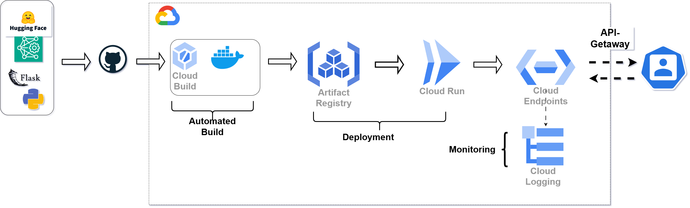

# ML Model Deployment on GCP 🚀  

This project demonstrates **end-to-end deployment** of an **ML-powered API** on **Google Cloud Platform (GCP)** using **Docker, CI/CD, and Cloud Run**.  

## **Project Overview**  
I deployed the **dslim/bert-base-NER model (Hugging Face)** to extract **named entities from PDFs** via an API. The model is wrapped in a **Flask API**, containerized with **Docker**, and deployed using **GitHub-triggered Cloud Build**. **Cloud Run** ensures a **scalable, serverless deployment**, while **Cloud Endpoints** manages security and authentication. **Cloud Logging** tracks API performance and errors.  

## **Key Steps in the Pipeline**  
1. **Model & API Development** – Integrated **dslim/bert-base-NER (Hugging Face)** with Flask to extract entities from PDFs.  
2. **CI/CD with GitHub & Cloud Build** – Automated the entire deployment pipeline.  
3. **Docker & Artifact Registry** – Containerized the application and stored it securely in Artifact Registry.  
4. **Cloud Run Deployment** – Ensured scalable, serverless hosting of the ML API.  
5. **Cloud Endpoints for API Management** – Enforced security, authentication, and rate limiting.  
6. **Cloud Logging for Monitoring** – Tracked API usage, errors, and system health.  

## **Architecture Overview**  

